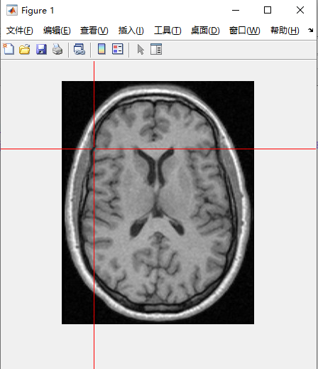

1.Introduction

Finite element simulation is the basis of electrical impedance tomography(EIT), and finite element model construction is the basis of finite element simulation. This code provides a rapid 2D and 2.5D 2D finite element model construction tool based on EIDORS.

2.Operating Procedure

First you must ensure that you have downloaded EIDORS and run it successfully. Download site: https://eidors3d.sourceforge.net/index.shtml.

Change line 3 of the main file to the address of the EIDORS file you saved.

Run the main file and then select an image to use as a profiling template.

